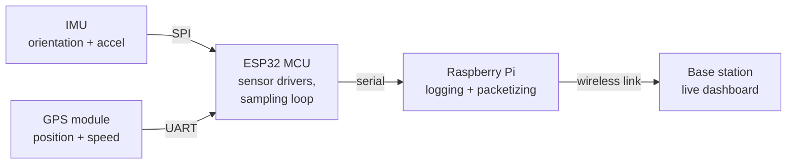

# M25baja-daq-telemetry

# Baja SAE — Data Acquisition & Live Telemetry

Sensor drivers, onboard logging, and a wireless telemetry link for UCLA's Baja SAE
off-road race car. A ESP32 microcontroller reads an IMU over SPI and a GPS module
over UART, streams the data to a Raspberry Pi for logging, and the Pi pushes it over
a wireless link to a base-station dashboard — giving the team live position,
orientation, and acceleration during testing runs.

<!-- TODO: drop your best hardware photo in docs/ and uncomment this line -->
<!--  -->

---

## Why this exists

Before this system, there was no way to see what the chassis was actually doing 
during a run, with only data logged after the fact. This project gave the team its
first real-time telemetry: what the car was doing, while it was doing it, visible from the pit.

---

## System architecture



**Acquisition (ESP32).** Drivers poll the IMU over SPI and parse the GPS stream over
UART, timestamp both against a common clock, and pack them into fixed-size frames sent
over serial to the Pi.

**Logging (Raspberry Pi).** The Pi writes every frame to disk for post-run analysis and
simultaneously forwards frames to the telemetry link, so a dropped radio connection
never costs the team its data.

**Telemetry (base station).** Frames arriving at the base station feed a live dashboard
showing position, speed, and acceleration as the car runs.

---

## Hardware

| Component | Part | Interface | Notes |
|---|---|---|---|
| Microcontroller | ESP32 S3 | — | Sensor acquisition and framing |
| IMU | Adafruit 9-DOF Orientation IMU Fusion Breakout - BNO085 | SPI | Orientation and acceleration |
| GPS | Ultimate GPS Breakout v3 | UART | Position and ground speed |
| Companion computer | Raspberry Pi <!-- TODO: model --> | Serial from ESP32 | Logging and link management |
| Wireless link | <!-- TODO: radio/module + antenna --> | — | Car to base station |

> The antenna and radio hardware are listed as TODO because I want the part numbers to
> be accurate rather than approximate — filling these in is on my list.

---

## What I built

To be precise about scope, since this was a team car:

**Mine:**
- IMU driver over SPI and GPS driver over UART on the ESP32
- Integration of both into the car's data acquisition system, including timestamping and frame format
- Raspberry Pi side: logging, and the wireless link that streams data to the base station
- Dashboard PCB and wiring harness (design work; see note below)

**The team's:** the vehicle itself, the electrical system it plugs into, and everything
outside the DAQ and telemetry subsystem.

This repository contains only code I wrote personally. Schematics, layout files, and
other team design artifacts are deliberately not published here.

---

## Repository structure

```
firmware/        ESP32 — IMU (SPI) and GPS (UART) drivers, sampling loop, framing
telemetry/       Raspberry Pi — serial ingest, logging, link transmit
docs/            Photos, block diagram, notes
```

<!-- ---

## Results

TODO: fill these in once you can measure them. Delete any line you can't support
     with a real number — an empty row reads better than an invented one.

| Metric | Measured |
|---|---|
| Sensor update rate | _TBD_ |
| Telemetry range (line of sight) | _TBD_ |
| Packet loss at range | _TBD_ |
| Log file size per run | _TBD_ |

The system ran during team testing sessions and was used to monitor vehicle position
and speed in real time. -->

---

## What I'd do differently

<!-- TODO: replace these with your own — this section is the most valuable one in the
     README, and reviewers read it as a direct signal of engineering judgment. Two or
     three honest items beat ten generic ones. Some starting points, keep what's true: -->

- **Timestamp discipline.** Sensor timestamps come from the ESP32's clock with no
  correction against GPS time, so long runs accumulate drift against absolute time.
  Disciplining the loop to GPS PPS would fix this cheaply.
- **Framing robustness.** The serial protocol between ESP32 and Pi has no sequence
  numbers or CRC, so a corrupted frame is silently accepted rather than dropped.
- **Link characterization.** The radio link was validated by "it worked at the test
  site" rather than by a measured range and packet-loss curve. That measurement should
  have come before competition, not after.

---

## Attribution

Built as part of Bruin Racing Baja SAE at UCLA. Published with the subsystem scope
described above; team design files are not included.

**Nirav Michelsen** — Electronics Hardware Project Engineer, Bruin Racing Baja SAE
[LinkedIn](https://linkedin.com/in/nirav-michelsen)
