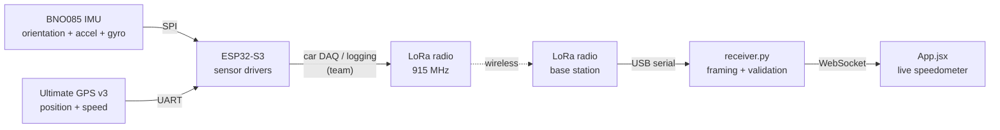

# Baja SAE — IMU/GPS Drivers & Live Telemetry Dashboard

Sensor drivers and a base-station telemetry stack for UCLA's Baja SAE off-road race car
(Bruin Racing). An ESP32-S3 reads a BNO085 IMU over SPI and a GPS module over UART. On the
base-station side, a Python receiver takes GPS packets arriving over a 915 MHz LoRa link and
streams them to a React speedometer dashboard. That gives the team the car's position and
speed during testing runs.

<!-- TODO: drop your best hardware photo in docs/ and uncomment this line -->
<!--  -->

---

## Why this exists

Before this, the team could only see what the car did after a run, by pulling logs. This
subsystem was part of the team's first real-time telemetry: where the car was and how it
was moving, visible from the pit while it was still running.

---

## System architecture


```mermaid
flowchart LR
    IMU["BNO085 IMU<br/>orientation + accel + gyro"] -- SPI --> MCU["ESP32-S3<br/>sensor drivers"]
    GPS["Ultimate GPS v3<br/>position + speed"] -- UART --> MCU
    MCU -- "car DAQ / logging<br/>(team)" --> TX["LoRa radio<br/>915 MHz"]
    TX -. wireless .-> RX["LoRa radio<br/>base station"]
    RX -- USB serial --> REC["receiver.py<br/>framing + validation"]
    REC -- WebSocket --> DASH["App.jsx<br/>live speedometer"]
```

**IMU driver (`firmware/`).** This driver talks to the BNO085 directly over SPI and implements
the sensor's own SHTP/SH-2 protocol, with no vendor library. It resets the sensor, turns on the
rotation-vector, accelerometer and gyroscope reports at 100 Hz, and reads SHTP packets using
the INT line as the "data ready" signal. It decodes the fixed-point report values and converts
the orientation quaternion into yaw, pitch and roll. One packet can hold several reports at once,
so the parser walks through the whole packet rather than reading only the first report.

**GPS driver (`firmware/`).** A small NMEA parser. It checks each sentence's checksum, reads GGA
(fix, satellites, position, altitude) and RMC (speed, course, UTC date and time), and doesn't care
which satellite system a sentence comes from (`$GP`, `$GN`, …). On startup it tells the module to
send only RMC and GGA, once per second.

**Base-station receiver (`telemetry/receiver.py`).** Reads 8-byte position packets from the
base-station LoRa radio. The packet format has no start marker, so the receiver finds packet
boundaries from the quiet gap between them. That way a byte lost over the air can't throw every
later packet out of alignment. It rejects coordinates that are off the globe or that would mean
the car moved faster than it physically can, and it resets its reference point if the last
accepted fix itself turns out to be the bad one. Good packets go out as JSON over WebSocket to
any connected dashboard.

**Live dashboard (`telemetry/App.jsx`).** A React speedometer that connects to the receiver's
WebSocket. The link only carries position, so the dashboard works out speed itself: it takes the
haversine distance between consecutive fixes and divides by the time between them. Readings under
0.3 m/s count as zero, so GPS jitter doesn't show a parked car as moving, and an exponential
moving average smooths out the needle. It shows mph, km/h, m/s or knots, and keeps a log of the
latest fixes. For testing without the car it has two more sources: the browser's own
geolocation (e.g. walk around with a phone) and a built-in simulated drive.

---

## Hardware

| Component | Part | Interface | Notes |
|---|---|---|---|
| Microcontroller | ESP32-S3 | — | Sensor acquisition |
| IMU | Adafruit 9-DOF Orientation IMU Fusion Breakout — BNO085 | SPI (3 MHz, mode 3) | Orientation, acceleration, angular rate |
| GPS | Adafruit Ultimate GPS Breakout v3 | UART (9600 baud) | Position, ground speed, course |
| Telemetry radio | SparkFun LoRaSerial, 915 MHz | UART (57600 baud) | Car ↔ base station |
| Base-station antenna | 902–930 MHz, 5.8 dBi fiberglass collinear omnidirectional | — | — |

### Pin map (ESP32-S3)

| Signal | GPIO | | Signal | GPIO |
|---|---|---|---|---|
| IMU MOSI (DI) | 42 | | IMU INT | 39 |
| IMU MISO (SDA) | 9 | | IMU RST | 47 |
| IMU SCK (SCL) | 10 | | GPS RX ← GPS TX | 44 |
| IMU CS | 41 | | GPS TX → GPS RX | 43 |

The BNO085 breakout has to be jumpered for SPI mode (PS0 and PS1 both high). GPIO 43/44 are
normally UART0's console pins, so the project moves the console to the S3's native USB port
(`sdkconfig.defaults`).

---

## What I built

To be precise about scope, since this was a team car:

**Mine:**
- BNO085 IMU driver over SPI, with the SHTP/SH-2 protocol written from the datasheet
- GPS NMEA driver over UART
- Base-station telemetry receiver (`receiver.py`): serial framing, validation, and the WebSocket feed
- Live speedometer dashboard (`App.jsx`): speed from GPS fixes, filtering, and test/demo modes

**The team's:** the vehicle and its electrical system; the integrated DAQ firmware that runs on
the car (shock-pot and brake-pressure sensors, binary logging frames); the Raspberry Pi logger that
sends GPS over the LoRa link. The team's final car firmware switched to a
library-based IMU driver, and this repo contains my original implementation.

---

## Repository structure

```
firmware/                 ESP-IDF project (ESP32-S3)
  main/main.cpp           Bring-up loop: polls both sensors, prints readings at 2 Hz
  main/include/pins.h     Pin map
  main/*/sensors/         IMU (SPI) and GPS (UART) drivers
telemetry/
  receiver.py             Base station: LoRa serial → validation → WebSocket
  App.jsx                 Live speedometer dashboard (React)
```

---

## Building and running

**Firmware**: requires [ESP-IDF](https://docs.espressif.com/projects/esp-idf/) v5.x.

```bash
cd firmware
idf.py set-target esp32s3
idf.py build flash monitor
```

**Receiver**: requires Python 3.9+.

```bash
cd telemetry
pip install -r requirements.txt
python receiver.py --port /dev/tty.usbmodem1101
```

The receiver serves `ws://<base-station-ip>:8765` and sends messages like
`{"lat": 34.0689, "lon": -118.4452, "timestamp": 1714500000000}`.

**Dashboard**: requires Node.js. `App.jsx` is a single component that goes into a stock Vite
React app:

```bash
npm create vite@latest speedo-app -- --template react
cd speedo-app
npm install
cp ../telemetry/App.jsx src/App.jsx
npm run dev
```

Open the local URL Vite prints. Enter the receiver's WebSocket address (the default is
`ws://localhost:8765`) and connect, or pick **Simulate** to try it without any hardware.

<!-- ---

## Results

TODO: fill these in once you can measure them. Delete any line you can't support
     with a real number — an empty row reads better than an invented one.

| Metric | Measured |
|---|---|
| IMU report rate | _TBD_ |
| GPS update rate | 1 Hz |
| Telemetry range (line of sight) | _TBD_ |
| Packet loss at range | _TBD_ |

---

## What I'd do differently

     TODO: replace these with your own — this section is the most valuable one in the
     README, and reviewers read it as a direct signal of engineering judgment. Two or
     three honest items beat ten generic ones.

-->

---

## Attribution

Built as part of Bruin Racing Baja SAE at UCLA. Published with the subsystem scope
described above; team design files and code are not included.

**Nirav Michelsen**, Electronics Hardware Project Engineer, Bruin Racing Baja SAE ·
[LinkedIn](https://linkedin.com/in/nirav-michelsen)
